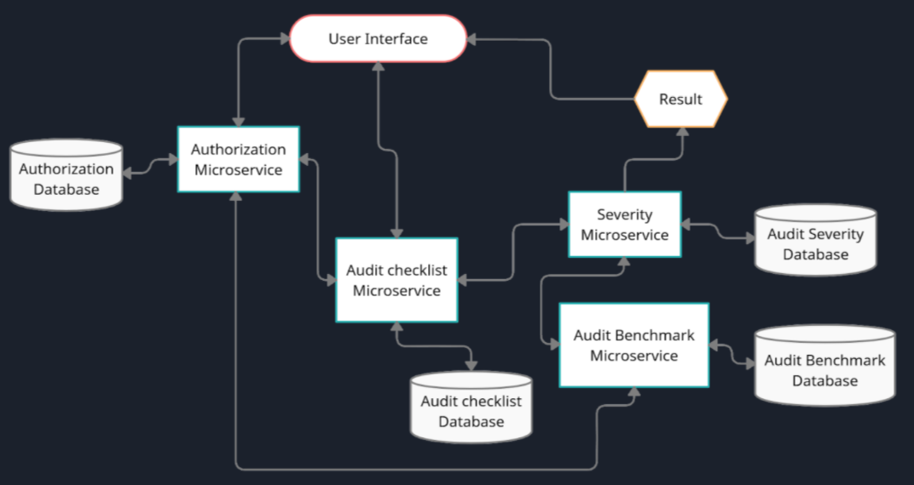
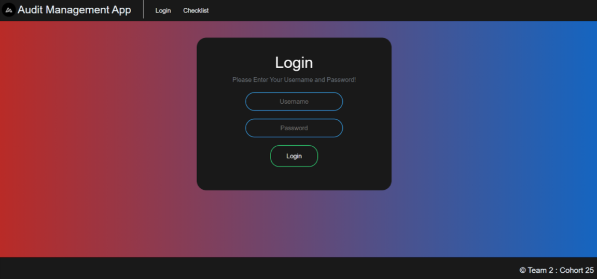
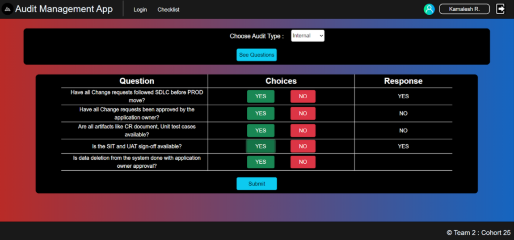
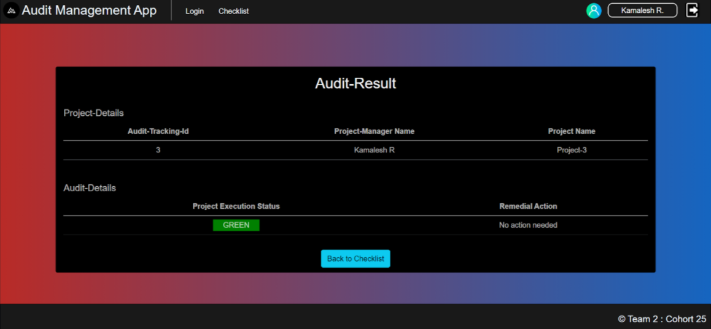

# CDE-MFPE-Project-Audit-Management-System

## Authors :

<table>
  <tr>
      <td>
        <a href="https://github.com/DRoy7">Deep Roy</a>
        </td>
      <td>
        <a href="https://github.com/sriharish252">Sri Harish</a>
        </td>
      <td>
        <a href="https://github.com/Kamalesh8">Kamalesh R</a>
        </td>
      <td>
        <a href="https://github.com/Megha0699">Megha S</a>
        </td>
      <td>
        <a href="https://github.com/greninja199">Praduman Kumar</a>
        </td>
    </tr>
</table>

## Overview::

* ### How to run this project || Execution :
  #### --Dependencies on Other microsevices : ** You should have Java 8 or any version above that, maven, angular-cli - to run this project**
  Git clone the project first. Then follow the steps below : 

  #### --Steps after getting the project in your local machine : 
    

  * #### 1> USING CMD OR TERMINAL 
    * ##### 1.1> Open CMD or any terminal and go to the "ExecuteAll" folder 
    * ##### 1.2> run the "ExecuteProject" batch file 

  * #### 2> Another way is -- Just go to the "ExecuteAll" folder and run the "ExecuteProject" batch file 

* ### User Flow of the Audit Management App : 
    * #### 1> Audit management Portal allows a member to Login. 
    * #### 2> Once successfully logged in, the member do the following operations: 
    * #### 3> Choose the audit type to view the list of audit checklist questions
    * #### 4> Let the project manager provide answers to the questions 
    * #### 5> Invoke the Audit Severity Microservice to determine the project execution status
    * #### 6> Display the result on the Web UI 
    * #### 7> The audit response detail along with the project execution status and remedial action duration should be saved to the database
    
* ### Internal connectivity of the Audit Management App and the Microservices : 
    

* ### Screenshots : 
    
    
    
    
